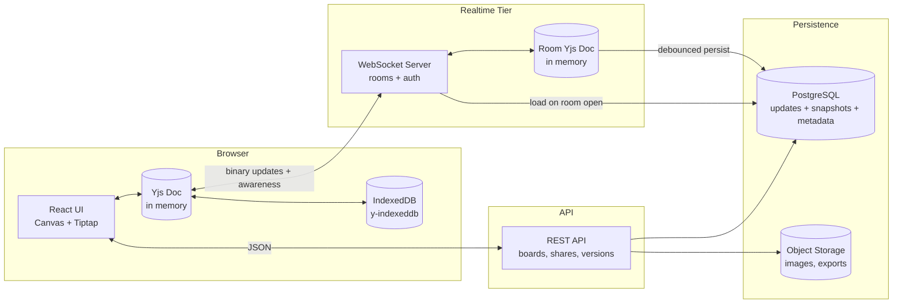

# 🧺 Mesob

> **A shared table for ideas.** A real-time collaborative infinite canvas with embedded rich-text documents, built on CRDTs, with live presence, full offline support, and time-travel version history.

*A **mesob** is the woven basket-table that Ethiopian families gather around to share one meal. Everyone reaches into the same plate. That's the product: everyone reaches into the same canvas.*

**Role:** Senior full-stack portfolio flagship
**Core tech:** Yjs (CRDT), WebSockets, React, TypeScript, Postgres
**Hosting goal:** 100% free tiers (verify current limits before deploying, as they change)

> 📐 **Engineering plan:** [`docs/`](./docs/README.md) — 14 documents covering system design,
> architecture, frontend, backend, storage, auth, hosting, CI/CD, security, caching, observability,
> testing, and scaling, with milestone gates G1–G6 and the open questions to settle before Phase 1.

---

## 1. The Idea

Most whiteboards are either a canvas (Miro, FigJam) or a document (Notion, Google Docs). Mesob deliberately merges them:

- An **infinite canvas** with shapes, sticky notes, arrows, freehand ink, and images.
- **Document blocks** you can drop anywhere on the canvas. Each is a full rich-text editor (headings, lists, code, checklists) whose text merges character-by-character across users.
- Everything is one shared **CRDT document**, so it works offline, merges without a central referee, and never loses anyone's edits.

**What this project proves about you**
| Skill | Where it shows |
|---|---|
| Distributed systems thinking | CRDT convergence, causality, tombstones, garbage collection |
| Real-time infrastructure | WebSocket server, rooms, backpressure, reconnect logic |
| Frontend depth | Custom canvas renderer, hit-testing, viewport math, 60fps interaction |
| Data engineering | Snapshotting, compaction, storage design, restore semantics |
| Product sense | Presence, follow mode, conflict visualizer, sharing and roles |
| Quality engineering | Convergence fuzz tests, partition simulation, multi-browser E2E |

---

## 2. Feature Set

### 2.1 Canvas
- Pan / zoom (infinite canvas, pinch and wheel support)
- Shapes: rectangle, ellipse, sticky note, text, arrow (with connectors that follow shapes), freehand pen
- Select, multi-select (marquee), move, resize, rotate, group, z-order
- Snap-to-grid and alignment guides
- Image drop (stored as compressed data URLs at first, object storage later)
- Keyboard shortcuts and a command palette (`Ctrl/Cmd + K`)

### 2.2 Document blocks (rich text on canvas)
- Tiptap/ProseMirror editor bound to a shared Yjs fragment
- Headings, bullet/numbered lists, task lists, code blocks, inline formatting
- Concurrent typing in the same paragraph merges correctly
- Full **Amharic (Ethiopic script)** support with a proper font stack

### 2.3 Real-time presence
- Live cursors with name and color labels
- Live selection outlines ("Selam is editing this shape")
- Text cursors and selections inside document blocks
- **Follow mode:** click a collaborator to mirror their viewport
- **Laser pointer:** temporary fading trail for presentations
- Throttled and interpolated cursor movement so it looks smooth without flooding the network

### 2.4 Offline-first
- Every edit is applied locally first, so the UI never waits for the network
- `y-indexeddb` persists the document in the browser
- Edit offline for as long as you like, then reconnect and merge automatically
- **Reconnect summary:** "You were offline for 12 min. 34 remote changes merged", with the merged changes briefly highlighted on the canvas
- Installable PWA

### 2.5 Version history (time travel)
- Automatic snapshots (time-based and activity-based)
- Named versions ("Before client review")
- **Timeline scrubber:** drag through history and watch the board rebuild
- **Restore as a new revision.** Restoring never rewrites history; it creates a forward change
- Per-version author attribution and a diff summary ("+5 shapes, 2 text edits")
- **Time-lapse replay:** export the board's creation as a short animation

### 2.6 Sharing and permissions
- Share links with roles: **Owner / Editor / Commenter / Viewer**
- Signed, expiring tokens verified at WebSocket handshake time (not just on the REST API)
- Guest access with a display name, plus optional sign-in
- Read-only enforcement on the **server**, not just the UI

### 2.7 The signature demo feature: Conflict Visualizer 🔬
A developer-mode panel that makes the CRDT visible:
- Shows the **operation log** as it arrives, with each client's Lamport clock / client ID
- Lets you **simulate a network partition** between two browser tabs
- Lets you make conflicting edits on each side (e.g., both move the same shape, both edit the same sentence)
- Reconnects them and animates exactly **how the merge resolved**

Reviewers remember this. It turns an invisible algorithm into something they can watch.

---

## 3. Architecture



### How sync works (the core protocol)
1. Client connects with a signed token. The server verifies role and room.
2. **Sync step 1:** the client sends its *state vector* (a compact summary of what it has).
3. **Sync step 2:** the server replies with only the *missing updates*, and asks for the client's missing pieces in return.
4. From then on, every local change is encoded as a small **binary update** and broadcast to the room.
5. **Awareness** (cursors, selections, names) rides a separate ephemeral channel. It is never persisted.
6. The server debounces writes: it appends updates to Postgres, and periodically **compacts** them into a single snapshot.

### Key design decisions

The five expensive-to-reverse ones have full records in [`docs/adr/`](./docs/adr/README.md): CRDT
model and granularity, shape representation and z-order, restore semantics, the authorization
enforcement point, and hosting. The rest of the decision table lives in
[`docs/01-system-design.md`](./docs/01-system-design.md#5-key-design-decisions) with its rejected
alternatives.
| Decision | Choice | Why |
|---|---|---|
| CRDT library | **Yjs** | Fast, compact binary format, mature ecosystem (Tiptap/ProseMirror bindings, IndexedDB, awareness) |
| Transport | WebSocket, binary frames | Low overhead for frequent small updates |
| Shape storage | `Y.Map<shapeId, Y.Map>` | Per-property last-writer-wins gives sensible merges (two users can move and recolor the same shape concurrently) |
| Z-order | Fractional indexing string per shape | Avoids array-reorder conflicts |
| Text | `Y.XmlFragment` via y-prosemirror | Character-level merge, undo per user |
| Undo/redo | `Y.UndoManager` scoped per user | You only undo *your* changes, not a teammate's |
| Persistence | Update log + periodic snapshot in Postgres | Simple, free-tier friendly, enables history |
| Presence | Yjs Awareness (ephemeral) | Should not pollute document history |
| Auth | Token checked at handshake **and** on every message type | Prevents a viewer from sending write updates |

---

## 4. Tech Stack

| Layer | Technology |
|---|---|
| Frontend | React + TypeScript, Vite |
| Canvas rendering | HTML Canvas 2D (custom renderer) first; optional WebGL/Pixi as a stretch |
| Rich text | Tiptap + `y-prosemirror` |
| CRDT | Yjs, `y-protocols` (sync + awareness), `y-indexeddb` |
| State | Zustand for UI-only state (tool, panels); **document state lives only in Yjs** |
| Realtime server | Node.js + `ws` (or Hocuspocus) in TypeScript |
| REST API | Fastify + Zod |
| Database | PostgreSQL (updates, snapshots, boards, shares) |
| Auth | Signed JWT share tokens; optional OAuth (GitHub/Google) |
| Testing | Vitest, fast-check (property/fuzz), Playwright (multi-tab), k6 (WebSocket load) |
| CI/CD | GitHub Actions |
| Observability | Pino logs, basic metrics endpoint, Sentry free tier |

---

## 5. Free Hosting Plan

> Free-tier limits change often. Check each provider's current pricing page before committing.

### Option A: Simple and reliable
| Component | Free option | Notes |
|---|---|---|
| Frontend | **Cloudflare Pages** or **Vercel** | CDN, automatic deploys |
| WebSocket + API server | **Render** free web service, or **Koyeb** / **Fly.io** | Free instances may sleep when idle, so cold starts apply |
| PostgreSQL | **Neon** or **Supabase** | Serverless Postgres, free tier |
| Images/exports | **Cloudflare R2** or Supabase Storage | Free quota |
| Uptime / keep-warm | **UptimeRobot** | Also feeds your status badge |

### Option B: Edge-native (more impressive, more to learn)
| Component | Free option | Notes |
|---|---|---|
| Realtime rooms | **Cloudflare Workers + Durable Objects** (one object per board) | Each board is a naturally single-threaded room. Check the free-plan availability and limits |
| Persistence | Durable Object storage + periodic snapshot to R2/D1 | Fewer moving parts |
| Frontend | Cloudflare Pages | Same platform |

**Tip:** Start with Option A so you ship. If you have time, port the realtime tier to Option B and document the trade-offs. That comparison is excellent case-study material.

**Cold-start mitigation (write this up):** cache the app shell with a service worker, open the board instantly from IndexedDB, and connect in the background. Users can start editing before the server has even woken up, which is a live demonstration of offline-first.

---

## 6. Data Model

```
boards
  id, title, owner_id, created_at, updated_at

board_updates            -- append-only log of Yjs binary updates
  id (bigserial), board_id, update BYTEA, client_id, created_at

board_snapshots          -- compacted full state, plus history checkpoints
  id, board_id, state BYTEA, state_vector BYTEA,
  kind ('auto' | 'named' | 'compaction'), label, author_id, created_at

shares
  id, board_id, role, token_hash, expires_at, created_by

users (optional)
  id, name, email, avatar_color

comments (stretch)
  id, board_id, anchor (shape id or text range), author_id, body, resolved
```

**Loading a room:** load latest compaction snapshot, then apply any updates newer than it.
**Compaction:** merge updates into one snapshot in a background job and delete the old rows.
**Version restore:** decode the snapshot into a temporary doc, compute the diff to the current doc, and apply it as a *new* update, so history stays intact.

---

## 7. API and Protocol Sketch

```
REST
POST   /boards                          create board
GET    /boards/:id                      metadata
POST   /boards/:id/shares               create share link { role, expiresIn }
DELETE /shares/:id                      revoke
GET    /boards/:id/versions             list snapshots
POST   /boards/:id/versions             create named version
POST   /boards/:id/versions/:vid/restore
GET    /boards/:id/export?format=png|svg|md

WebSocket  wss://.../rooms/:boardId?token=...
  binary message types (y-protocols):
    0  sync (step1 / step2 / update)
    1  awareness
  custom JSON control channel:
    { type: "role", role }            server tells client its permission
    { type: "kick" | "revoked" }
```

---

## 8. The Hard Problems (your case-study material)

1. **Convergence you can prove.** Fuzz test: N simulated clients perform random concurrent operations with random delivery order, drops, and duplicates. Assert every replica ends up identical.
2. **Document growth.** CRDTs keep history (tombstones). Explain how Yjs garbage collection works, when you keep history for versions (`gc: false` on history docs) versus compact for live rooms, and measure document size over time.
3. **Authorization in a CRDT world.** Once an update is merged it's very hard to undo. So enforce permissions **before** applying updates on the server, and reject write messages from viewers.
4. **Restore semantics.** Why "restore" must be a forward operation in a CRDT, not a rollback.
5. **Presence at scale.** Awareness fan-out is O(n²) per room. Throttle, batch, and drop stale clients. Measure bandwidth at 10, 50, and 100 users.
6. **Connector consistency.** Arrows that reference shapes need a sane result when the target is deleted concurrently.
7. **Rendering performance.** Viewport culling, dirty-rectangle redraws, and spatial indexing for 5,000+ shapes at 60fps.
8. **Reconnect storms.** Many clients returning at once (e.g., after a server restart). Add jittered exponential backoff.
9. **Free-tier constraints.** Sleeping servers, connection limits, and storage caps. Document how you designed around them.

---

## 9. Suggested Folder Structure

```
mesob/
├── apps/
│   ├── web/                  # React PWA
│   │   └── src/
│   │       ├── canvas/       # renderer, hit-testing, tools, viewport math
│   │       ├── doc-blocks/   # Tiptap bindings
│   │       ├── collab/       # provider, awareness, offline, reconnect summary
│   │       ├── history/      # timeline scrubber, restore UI
│   │       └── devtools/     # conflict visualizer
│   ├── realtime/             # WebSocket server (rooms, auth, persistence)
│   └── api/                  # REST API (boards, shares, versions, export)
├── packages/
│   ├── schema/               # Yjs document schema + helpers + migrations
│   ├── shared/               # Zod types, token utils, constants
│   └── sim/                  # Fuzz + partition simulator (used by tests AND the visualizer)
├── docs/
│   ├── adr/                  # Architecture decision records
│   ├── protocol.md
│   ├── threat-model.md
│   └── benchmarks.md
├── tests/
│   ├── e2e/                  # Playwright multi-tab scenarios
│   └── load/                 # k6 WebSocket scripts
└── README.md
```

**Nice touch:** `packages/sim` powers both your automated fuzz tests and the on-screen Conflict Visualizer, so one investment pays off twice.

---

## 10. Build Roadmap (about 8 weeks)

### Phase 1: Local-first canvas (Week 1–2)
- [ ] Monorepo, TypeScript, lint, CI
- [ ] Canvas renderer with pan/zoom, shapes, select/move/resize
- [ ] **Document state stored in Yjs from day one**, even before networking
- [ ] Undo/redo via `Y.UndoManager`
- [ ] Persist locally with `y-indexeddb`

*Milestone: a solid single-user, offline whiteboard.*

### Phase 2: Real-time sync (Week 3)
- [ ] WebSocket server with rooms and the Yjs sync protocol
- [ ] Postgres persistence (update log, load on room open)
- [ ] Two tabs editing the same board live
- [ ] Reconnect with backoff, connection status indicator

### Phase 3: Presence (Week 4)
- [ ] Live cursors, names, colors
- [ ] Selection outlines
- [ ] Follow mode and laser pointer
- [ ] Throttling + interpolation

### Phase 4: Documents on canvas (Week 5)
- [ ] Tiptap block bound to `Y.XmlFragment`
- [ ] Remote text cursors
- [ ] Amharic font support and input testing
- [ ] Concurrent-typing tests

### Phase 5: Versions and sharing (Week 6)
- [ ] Snapshots, compaction job
- [ ] Timeline scrubber and restore-as-new-revision
- [ ] Share links, roles, server-side enforcement
- [ ] Reconnect summary UI

### Phase 6: Proof and polish (Week 7–8)
- [ ] Fuzz-test suite in `packages/sim`
- [ ] **Conflict Visualizer** devtools panel
- [ ] k6 load test and published benchmarks
- [ ] Export (PNG/SVG/Markdown)
- [ ] Deploy to free tiers, add uptime badge
- [ ] Demo video and case study

---

## 11. Testing Strategy

| Type | What it checks |
|---|---|
| Unit | Geometry, hit-testing, fractional indexing, token verification |
| **Property / fuzz** (fast-check) | All replicas converge under random ops, reordering, duplication, drops |
| Integration | Realtime server + real Postgres: persistence, compaction, reload |
| **Partition tests** | Two clients edit offline, reconnect, and merge with no lost edits |
| E2E (Playwright, multi-context) | Two browsers: draw, type, move cursors, follow mode, restore version |
| Security | Viewer cannot write, expired or revoked token is rejected mid-session |
| Load (k6) | 50 to 100 clients per room: p95 update latency, bandwidth, memory |
| Performance | Frame time with 5,000 shapes, measured and charted |

---

## 12. Metrics to Publish

Put real numbers in your README. This is what makes it senior-level.

| Metric | Target (example) |
|---|---|
| p95 update propagation latency (same region) | < 150 ms |
| Concurrent editors per room tested | 50+ |
| Convergence fuzz runs passing | 10,000+ |
| Frame time at 5,000 shapes | < 16 ms with culling |
| Doc size after 1 hour of heavy editing (with/without compaction) | measured and charted |
| Time to interactive on a cold start (from IndexedDB) | < 1 s |

---

## 13. Portfolio Deliverables Checklist

- [ ] Live demo link with a **"Try it with a friend" button** (opens a fresh board and copies the invite link)
- [ ] Public repo with this README refined as you build
- [ ] 2-minute demo video: two browsers, cursors, offline edit, reconnect merge, time-travel restore
- [ ] Conflict Visualizer shown in the video
- [x] 5 ADRs (CRDT choice, shape schema, restore semantics, authorization, hosting) — [`docs/adr/`](./docs/adr/README.md)
- [ ] Threat model
- [ ] Benchmarks page with charts
- [ ] Case study: the hardest bug you hit and how you found it

### Suggested demo script (90 seconds)
1. Open a board in two windows. Draw and type together while cursors move.
2. Turn on **airplane mode** in one window. Both edit the same sentence and move the same shape.
3. Reconnect. Show the merge summary and the Conflict Visualizer replaying it.
4. Open the timeline, scrub back, and restore an earlier version as a new revision.

---

## 14. Stretch Ideas

- **Comments and mentions** anchored to shapes or text ranges
- **Templates:** retro board, user-story map, brainstorm
- **Voice/huddle** using WebRTC (peer-to-peer, free)
- **AI assist:** "Cluster these sticky notes by theme" or "Summarize this board into a doc block"
- **Presentation mode** with frames and a laser pointer
- **WebGL renderer** for 50k+ shapes
- **Peer-to-peer mode** with WebRTC as an alternative to the server
- **Automerge port** of the document layer to compare the two CRDTs in a write-up

---

## 15. Getting Started (once built)

```bash
git clone https://github.com/<you>/mesob.git
cd mesob
pnpm install
cp .env.example .env      # DATABASE_URL, JWT_SECRET
pnpm db:migrate
pnpm dev                  # web + realtime + api
```

---

## 16. Suggested Repo Badges

`build passing` · `tests: fuzz 10k runs` · `live demo` · `uptime` · `license: MIT`

---

**Built with ☕ in Addis Ababa.**