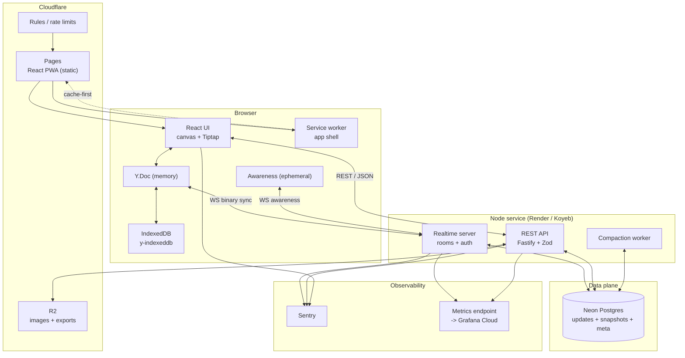

# 02 — System Architecture

> **Status: draft** · Depends on: [01 System Design](./01-system-design.md) · Read with: [04](./04-api-and-backend.md)

## Context

This document is the map: what runs, where it runs, which process owns which piece of state, and how
bytes move between them. It is the reference every other document links into, and the thing a
reviewer reads first when they want to know whether the system was actually thought through.

The one rule that organises everything else: **document state has exactly one owner at a time.**
Locally that is the browser's Y.Doc. On the server it is the in-memory room doc. Postgres is a
durable log, never an editing surface.

---

## 1. Runtime topology (Option A, the shipping deployment)



**Why one Node service hosting both the realtime server and the REST API.** One deploy, one
connection pool, one set of env vars, one process to sleep and one to cold-start. It is the right
call at this scale and on free tiers. The cost is that a long-lived WebSocket can keep the process
busy while a request is in flight; the split is documented in
[14 Scaling](./14-scaling.md#6-breakout-triggers-to-option-b) as a breakout trigger rather than
pretended away here.

### Process inventory

| Process | Package | Runtime | Responsibility | Stateless? |
|---|---|---|---|---|
| Web app | `apps/web` | Browser | Rendering, editing, CRDT client, IndexedDB, PWA | n/a |
| Realtime server | `apps/realtime` | Node 20+ | WebSocket upgrade, room lifecycle, sync protocol, fan-out, debounced persistence | No (holds room docs) |
| REST API | `apps/api` | Node 20+ | Boards, shares, versions, export, image upload | Yes |
| Compaction worker | `apps/api` (in-process) or `apps/realtime` (in-process) | Node 20+ | Merges update logs into snapshots, prunes, retention | No |
| Migrations | `packages/db` | CLI | Applies SQL migrations on deploy | Yes |

The compaction worker runs in-process, guarded by a Postgres advisory lock so that if we ever scale
to two API instances, only one compacts. That is the cheapest correct answer at this scale, and it
is a real pattern, not a shortcut we will be embarrassed by.

---

## 2. Component boundaries

### apps/web

| Directory | Responsibility | Must not |
|---|---|---|
| `src/canvas/` | Renderer, hit-testing, viewport math, tools, transforms, snapping | Know anything about the network |
| `src/doc-blocks/` | Tiptap/ProseMirror editors bound to `Y.XmlFragment`, remote cursors | Own document state outside Yjs |
| `src/collab/` | Provider, awareness, IndexedDB, reconnect, backoff, merge summary | Contain business rules |
| `src/history/` | Timeline scrubber, version list, restore UI | Mutate the doc outside a single `restore` action |
| `src/devtools/` | Conflict Visualizer, driven by `packages/sim` | Reach into app internals via hacks |
| `src/store/` | Zustand slices for **UI-only** state | Mirror anything that lives in the Y.Doc |
| `src/app/` | Routing, layout, error boundaries, route loaders | Contain feature logic |

The `must not` column is enforced in review and, for the sharpest one (no mirrored doc state), by a
lint rule: importing a shape selector into a component that is not inside the canvas or blocks layer
is flagged.

### apps/realtime

| Module | Responsibility |
|---|---|
| `server.ts` | HTTP server, WS upgrade, graceful shutdown |
| `auth/handshake.ts` | Token verification, board lookup, role resolution (see [06](./06-auth-and-permissions.md)) |
| `rooms/room.ts` | One room: Y.Doc, awareness map, client set, timers |
| `rooms/manager.ts` | Room registry, load-on-first-client, idle eviction |
| `protocol/` | y-protocols sync + awareness message handling, size caps, frame types |
| `persist/` | Debounced update append, snapshot write, compaction trigger |
| `metrics/` | Counters, gauges, histograms, `/metrics` route |
| `guards/` | Per-message authorization (the single enforcement point) |

### apps/api

| Module | Responsibility |
|---|---|
| `routes/boards.ts` | Create, get, list, delete boards |
| `routes/shares.ts` | Create share links, list, revoke |
| `routes/versions.ts` | List versions, create named version, restore |
| `routes/export.ts` | PNG / SVG / Markdown export jobs |
| `routes/uploads.ts` | Presigned R2 upload + finalize |
| `auth/` | REST middleware: session cookie or bearer token, role lookup |
| `ratelimit.ts` | Token-bucket per IP and per token |
| `schema.ts` | Zod request/response contracts, shared with `packages/shared` |

### packages

| Package | Contents | Consumed by |
|---|---|---|
| `packages/schema` | Yjs doc schema, factories, validators, migrations, geometry types | web, realtime, api, sim |
| `packages/shared` | Zod types, token utils, error codes, flags, constants | web, realtime, api |
| `packages/sim` | Deterministic simulator: ops, scheduler, partition model, convergence assert | tests, **web devtools** |
| `packages/db` | Pool, query helpers, migrations, repositories | realtime, api |

**Dependency rule:** `packages/*` never import from `apps/*`. The dependency graph is acyclic by
construction, and CI enforces it with a dependency-cruiser rule set.

---

## 3. State ownership

The most important table in this document. When two things can write the same state, one of them is
wrong.

| State | Authoritative owner | Mirrored? | Notes |
|---|---|---|---|
| Shapes, blocks, text, z-order | The browser's Y.Doc | Server holds a replica in memory; Postgres holds a log | Convergence is what makes the replica safe |
| Server room doc | `apps/realtime` room instance | n/a | Rebuilt from Postgres on first client |
| Durable board content | Postgres `board_updates` + `board_snapshots` | n/a | Log is the source of truth for reconstruction |
| Board metadata (title, owner) | Postgres `boards` | Mirrored into `meta` in the doc for title display | Postgres wins on conflict; doc `title` is a cache |
| Share links and roles | Postgres `shares` | n/a | Never in the doc — a doc cannot enforce its own permissions |
| Presence (cursors, selections, names) | Awareness, in-memory, per client | n/a | Never persisted, never in the log |
| UI state (active tool, open panel, viewport, selection) | Zustand | n/a | Per client. Never synced |
| Timeline position | Zustand, local | n/a | Viewing history is a read; it does not mutate the live doc |
| Comments | Postgres `comments` | n/a | D20: a Commenter must not write to the doc |

Consequences worth stating explicitly:

- **The server never "saves" the document.** It appends updates and compacts. Any code path that
  tries to reconcile two versions of a board by writing a new one is a bug.
- **The client never trusts its own doc as canonical.** After a restore or a schema migration, the
  server's state wins and the client updates.
- **Presence is not data.** If presence ever ends up in `board_updates`, snapshots get polluted and
  cursors become permanent. This is asserted by a test.

---

## 4. Data flow: a single shape move

The happy path, end to end, for one user dragging a rectangle. Every realtime system is understood
once this is clear.

```
User drags
  │
  ├─ 1. Pointer event → canvas hit-test → local drag state (Zustand, ephemeral)
  │
  ├─ 2. Throttled to rAF (~60/s) → shape.set('x', v) and shape.set('y', v)
  │      on the Y.Map. This mutates the Y.Doc locally and marks it dirty.
  │
  ├─ 3. Y.Doc 'update' event → encodeUpdate → binary Uint8Array
  │      (~40 bytes for a position change; the protocol's whole value proposition)
  │
  ├─ 4. Provider sends: [messageSync(0), update payload] over the WebSocket
  │
  ├─ 5. Server: guard.checkWrite(client.role)  →  if Viewer: drop + metric, no apply
  │
  ├─ 6. Server: Y.applyUpdate(room.doc, update, 'remote')
  │      └─ origin tag 'remote' stops the room doc from re-broadcasting this update
  │
  ├─ 7. Server: room.broadcast(update) to every client except the origin client's socket
  │      (the origin already has it)
  │
  ├─ 8. Other clients: Y.applyUpdate → 'update' fires with origin ≠ local
  │      → scene store marks that shape dirty → next rAF repaints just that rect
  │
  ├─ 9. Server: markRoomDirty(boardId) → debounced 2s timer
  │
  └─ 10. Timer fires: INSERT the buffered updates into board_updates (one multi-row insert),
         emit metrics, clear the debounce
```

Two properties fall out of this that matter:

- Step 8 redraws a dirty rectangle, not the whole canvas. That is the entire performance story
  ([03](./03-frontend.md#2-the-render-loop)).
- Step 5 happens *before* step 6. Reordering those two lines would let a Viewer's write land in a
  CRDT where it is nearly impossible to remove. This ordering is D10 and it is load-bearing.

---

## 5. Data flow: opening a board cold

The offline-first path. Must be under one second to first edit.

```
GET /boards/:id?token=…            ──►  metadata + role + snapshot key (no doc body)
GET /objects/:snapshotKey           ──►  full compacted state as one Yjs update (cached at edge)
  │
  ├─ Y.applyUpdate(doc, snapshot)        room opens at the latest state
  │
  ├─ IndexedDB (y-indexeddb) has a *newer* local state?
  │     └─ yes → the client is ahead or has offline edits; sync will reconcile
  │              the state vector exchange handles this without special-casing
  │
  ├─ First paint of shapes: ~1 frame after applyUpdate
  │
  └─ WebSocket connects in the background:
        1. client → server: SyncStep1 (its state vector)
        2. server → client: SyncStep2 (updates the client is missing) + SyncStep1 (server's vector)
        3. client → server: SyncStep2 (updates the server is missing)
        4. both sides now identical
        5. server → client: JSON { type: "role", role }
        6. awareness exchange (names, cursors, colours)
```

Note that step 5 happens *after* sync. The client must be able to render and edit the document it
already has before it learns its role, because a Viewer needs exactly that, and because an Editor
offline needs exactly that.

---

## 6. The sync protocol

Wire format is `y-protocols`, unmodified. We do not invent a protocol; we add a control channel and
a guard.

### Binary channel

| Outer message type | Name | Direction | Meaning |
|---|---|---|---|
| `0` | `sync` | both | y-protocols sync: step 1, step 2, or an incremental update |
| `1` | `awareness` | both | ephemeral presence payload |

### Control channel

JSON text frames on the same socket, namespaced by a `ctl` prefix so they can never be confused with
a binary frame.

| Message | Direction | Payload | Purpose |
|---|---|---|---|
| `ctl:hello` | client → server | `{ clientId, userName, color, boardVersion }` | Identify, and let the server reject an incompatible schema version early |
| `ctl:role` | server → client | `{ role, canWrite, canRestore }` | The single source of truth for what this socket may do |
| `ctl:kick` | server → client | `{ reason: 'revoked' \| 'expired' \| 'version' \| 'replaced' }` | Stop sending, and tell the user why in plain language |
| `ctl:error` | server → client | `{ code, message }` | Recoverable protocol error; the client retries with backoff |
| `ctl:ping` / `ctl:pong` | both | `{ t }` | Application-level liveness, distinct from the protocol's keepalive |
| `ctl:stats` | server → client | `{ roomSize, since }` | Dev-only: feeds the Conflict Visualizer and the connection indicator |

### Message handling contract

```
onMessage(socket, conn, buffer)
  1. if buffer.length > MAX_FRAME_BYTES      → ctl:error FRAME_TOO_LARGE, close 1009
  2. msgType = buffer[0]
  3. switch msgType
       SYNC      → guard.assertMayRead/Write(conn)  → readSyncMessage(...)
       AWARENESS → throttle + sanitize (strip anything > MAX_AWARENESS_FIELDS) → broadcast
       unknown   → ctl:error UNKNOWN_MESSAGE_TYPE, do not close
```

Every read of a room or application of an update passes through `guard`. There is exactly one
`applyUpdate` call site in the entire server, and it is inside the guard. This is enforced by
review and by a test that greps for unguarded `applyUpdate` in `apps/realtime`.

### Backpressure

- `socket.bufferedAmount` is checked before every broadcast. Above `BACKPRESSURE_HIGH` (1 MB) the
  server drops non-critical traffic (awareness first, then sync) and increments a metric.
- A slow client is **never** allowed to slow the room. When a socket is over the limit for more than
  5 s, it is closed with `ctl:kick reason:'too-slow'` and the client reconnects and re-syncs from its
  state vector. A CRDT makes this cheap: the client is a few hundred bytes behind at worst, and
  recovery is a state-vector exchange, not a document reload.
- Writes to Postgres are buffered in memory per room and flushed on a debounce (2 s) or a size
  threshold (256 KB or 500 updates, whichever comes first).

---

## 7. Room lifecycle

```
                     first client with a valid token
                                 │
                                 ▼
   ┌──────────┐   create   ┌──────────┐  hydrate   ┌──────────────┐
   │  absent  │───────────►│ loading  │───────────►│   live doc   │
   └──────────┘            └──────────┘            └──────────────┘
                                  │ timeout 5s          │   │  │
                                  ▼                    │   │  └─ last client
                             ┌──────────┐              │   └────► 60s idle
                             │  failed  │              └────────────┐
                             └──────────┘                             ▼
                                                             ┌──────────────┐
                                          no clients       │  idle (doc   │
                                          > 60 s           │  kept warm)  │
                                                             └──────────────┘
                                                                  │ > 10 min
                                                                  ▼
                                                          flush + evict
```

Rules:

- **Lazy hydration.** A room is only loaded from Postgres when someone connects. Ten thousand boards
  with zero activity cost nothing.
- **Idle grace 60 s.** Enough to survive a page refresh or a brief tab close without a full reload.
- **Eviction 10 min.** The final flush is awaited, then the room is dropped. Memory is the scarce
  resource on a small free instance.
- **Hydration is guarded by a singleflight.** Ten tabs opening the same board must produce one
  database read, not ten.
- **Max rooms per instance is configurable.** On a free instance it is deliberately low, and
  exceeding it evicts the least-recently-active idle room with a metric. Degrading gracefully beats
  OOM-killing the process.

---

## 8. Persistence flow

```mermaid
sequenceDiagram
  participant C as Client
  participant R as Realtime
  participant P as Postgres
  participant K as Compaction worker

  C->>R: binary update
  R->>R: guard.checkWrite(role)
  R->>R: Y.applyUpdate(doc, update, "remote")
  R-->>C: broadcast
  R->>R: room.pending.push(update); arm 2s debounce
  Note over R: many updates arrive, one flush
  R->>P: INSERT INTO board_updates (multi-row, single statement)
  R->>R: if pendingBytes > 256KB → flush immediately
  Note over K: every 60s, if updates since last compaction > 500
  K->>P: BEGIN; SELECT updates newer than latest compaction snapshot
  K->>K: Y.mergeUpdates(...) → single state
  K->>P: INSERT board_snapshots (kind='compaction', state, state_vector)
  K->>P: DELETE those board_updates
  K->>P: COMMIT
  K->>K: drop affected room's cached snapshot version → rooms reload lazily
```

Details, DDL, and the retention policy are in [05 Database and Storage](./05-database-and-storage.md).
The failure mode worth naming here: if the worker dies mid-compaction, the transaction rolls back,
the old updates remain, and the board still loads. Compaction is a pure optimisation and is written
so that a partial failure is indistinguishable from no run at all.

---

## 9. Restore semantics

Restoring a version is the operation most likely to corrupt a CRDT if done naively. The rule:
**restore is a forward update.**

```
POST /boards/:id/versions/:vid/restore

1. Load snapshot(vid) into a temporary Y.Doc  →  oldDoc
2. Load current live doc                       →  curDoc
3. Compute the delta that moves curDoc → oldDoc
     · deleted shape ids  → set tombstone/lastDeleted flag, do NOT remove the map key
     · changed props      → set the old value
     · added shapes       → insert the old Y.Map
     · text differences   → apply as a ProseMirror/Y.XmlFragment transaction
4. Wrap steps 3 in a single transaction, attributed to the restoring user
5. Broadcast as a normal update
6. Write a board_snapshots row of kind='named', label='Restored from <vid> by <user>'
```

Why step 3 does not delete keys: a Y.Map delete is itself a CRDT operation that must win against
concurrent writes. Producing a delete for a shape someone else just moved means arbitrating a
tombstone against a live write, which is where CRDT-based "restore" implementations lose data. The
safe formulation is *set every property to the historical value and mark the shape deleted*, which
converges the same way any other write converges.

An invariant test asserts that a restore **never removes entries from the update log** and that the
`board_updates` row count is monotonically non-decreasing. History is append-only, always.

---

## 10. The Option B port

Option A is what ships. Option B (Cloudflare Workers + Durable Objects, one object per board) is
written up in [07](./07-hosting-and-cloud.md#option-b-the-edge-native-port). The architectural property that
makes it a port rather than a rewrite is that the realtime server is written against a small
interface:

```ts
interface RoomTransport {
  join(boardId, token, meta): Promise<Conn>
  broadcast(boardId, fromConn, payload: Uint8Array): void
  persist(boardId, updates: Uint8Array[]): Promise<void>
  onAwareness(boardId, fromConn, payload: Uint8Array): void
}
```

Node `ws` implements this over a process-local room map. Durable Objects implement it with the room
map replaced by the object instance itself, which is naturally single-threaded per board and gets
free persistence and free per-object serialization. Nothing above this interface knows or cares.

What the port does **not** carry over: the compaction worker's Postgres dependency (DO storage is a
better fit, or snapshot to R2), and the metrics model (Workers uses `Workers Analytics Engine` or
`cf-analytics` instead of an in-process registry).

---

## 11. Architectural invariants

Enforced by tests where possible, by review otherwise. Each of these is a bug class, not a style
preference.

| # | Invariant | Enforcement |
|---|---|---|
| A1 | There is exactly one `Y.applyUpdate` on the server, and it is behind the write guard | Grep-based architecture test |
| A2 | Awareness data never enters `board_updates` | Integration test: hammer presence, assert the update log is unchanged |
| A3 | `board_updates` is never mutated or deleted except by compaction | DB role privileges: the API role gets `INSERT, SELECT` only |
| A4 | No component holds document state outside the Y.Doc | Lint rule; review |
| A5 | Every WS connection resolves a role before any doc operation | Server test: a socket with no `ctl:hello` cannot read or write |
| A6 | Restore only ever appends | Property test in [13](./13-testing.md#3-property-and-fuzz-testing) |
| A7 | A room's Postgres writes are ordered and idempotent under retry | Flush carries a monotonic sequence; duplicate inserts are detectable |
| A8 | The client renders before it connects | Perf harness asserts first paint < 1 s with the WS endpoint blackholed |
| A9 | `packages/*` never import `apps/*` | dependency-cruiser in CI |
| A10 | No app writes document state into Postgres directly | Only the persist module and the version routes touch `board_updates` |

## Acceptance

- [ ] Every process in the inventory is deployed and monitored in at least one environment
- [ ] The sync and restore flows are implemented exactly as diagrammed
- [ ] A1–A10 are enforced mechanically, not just written down
- [ ] `packages/shared` protocol types are used by both `apps/web` and `apps/realtime`, so a
      protocol change breaks the build in both places
- [ ] The local stack (`pnpm dev`) reproduces production topology with a local Postgres
