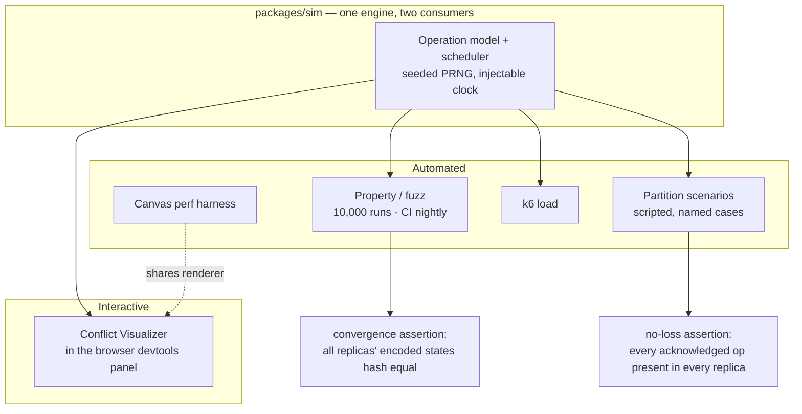

# 13 — Testing

> **Status: draft** · Related: [08 CI/CD](./08-cicd-and-version-control.md), [01 Goals](./01-system-design.md#4-non-functional-requirements)
> **This is the layer that turns the project's claims into evidence.** The root README promises
> convergence, no lost edits, and a conflict visualiser. Every one of those is a test.

---

## Context

Two of the three things this project claims are mathematical or near-mathematical:

- **Convergence.** A property that holds for all interleavings, or does not.
- **No lost edits under partition.** A property of the storage and merge path.

Neither can be established by example. A demo where two tabs happened to agree proves nothing. So
the test strategy is built around **property-based testing of a simulator that is also a product
feature**, plus the ordinary suite that keeps the app honest.

The unusual decision, and the one worth defending: **`packages/sim` is a single artefact used by both
the test suite and the browser's Conflict Visualizer.** The visualizer is therefore not a
reimplementation of the semantics — it *is* the tested semantics, running in front of a user. It
cannot drift from the tests, because it is the same code.

---

## 1. The shape of the suite



| Suite | Runs | Budget | What it protects |
|---|---|---|---|
| Unit | Every push | 2 min | Geometry, indices, schemas, tokens, error mapping |
| Property / fuzz | Every push (200) + nightly (10,000) | 3 min / 25 min | **Convergence** |
| Integration | Every push | 5 min | Real Postgres: persistence, compaction, reload, roles |
| Partition | Every push | 3 min | **No lost edits** across offline periods |
| E2E | Every push (Chromium), nightly (all three) | 8 min | The product, in a browser, with two users |
| Security | Every push | 2 min | **Authorization** — the highest-consequence property |
| Load | Nightly + manual | 15 min | Capacity evidence for the published numbers |
| Performance | Every push on the perf job, nightly full | 6 min | Frame time budget |
| Visual | Nightly | 4 min | Renderer regressions, Amharic rendering |

---

## 2. Unit tests

Fast, pure, no I/O. Coverage floors in [08 §2](./08-cicd-and-version-control.md#coverage-and-quality-gates).

| Area | Cases |
|---|---|
| **Geometry** | `screenToWorld`/`worldToScreen` round-trip at every zoom; resize with rotation; AABB of a rotated rect; point-in-ellipse; distance to a polyline; snapping candidates; zoom clamping |
| **Fractional indexing** | `between(a, b)` for: empty list, one element, first, last, two neighbours, repeated generation, 10,000 sequential appends staying ordered and short, deleting the head, splitting a list |
| **Hit testing** | Every shape type; tolerance scaling with zoom; z-order priority; handle hit beats shape hit; a shape exactly on a boundary |
| **Viewport** | Culling correctness against a brute-force scan, randomised; dirty-rect merging; the 8-rect fallback |
| **Shape factories** | Every type; defaults; clamping; **`NaN`/`Infinity` rejected**; a serialised shape round-trips |
| **Token utils** | Sign, verify, expiry, tampered payload, wrong secret, wrong audience |
| **Error mapping** | Every Zod issue → the right code and HTTP status; `message` is never used for control flow |
| **Capabilities** | The role matrix in [06 §4](./06-auth-and-permissions.md#4-role-matrix) is generated from `CAPABILITIES`, so a drift is a test failure |
| **Redaction** | A known token through the logger at every level → absent from output |
| **Quota / eviction** | LRU behaviour; the image cache cap; the storage estimate fallback |
| **Migration functions** | `v1 → v2` on a doc with every shape type, including empty and malformed cases; **no data loss** |
| **Export** | SVG output is deterministic for a given doc; Markdown round-trips a document block |
| **Diff summary** | Computed counts match a hand-worked example |

---

## 3. Property and fuzz testing

The core of the project. `fast-check` with a **seeded PRNG** so any failure is exactly reproducible
from its seed, which is printed in the failure message and written to `artifacts/fuzz/`.

### The model

```ts
// packages/sim/src/ops.ts
type Op =
  | { t: 'addShape';    shape: ShapeSpec }
  | { t: 'moveShape';   id: ShapeId; dx: number; dy: number }
  | { t: 'setProp';     id: ShapeId; prop: string; value: unknown }
  | { t: 'deleteShape'; id: ShapeId }
  | { t: 'reorder';     id: ShapeId; to: 'front' | 'back' | 'forward' | 'backward' }
  | { t: 'editText';    id: BlockId; at: number; insert: string; deleteLen: number }
  | { t: 'paste';       id: BlockId; html: string }
  | { t: 'undo';        clientId: ClientId }
  | { t: 'redo';        clientId: ClientId }
```

Every generator produces valid operations *and* deliberately awkward ones: shapes at the origin, a
`deleteShape` for a shape that does not exist, two shapes at the same coordinates, an `editText` that
deletes more than exists, a paste containing HTML that Tiptap will strip, a text edit inside a
deleted block.

### The properties

| # | Property | Assertion | Runs |
|---|---|---|---|
| **P1** | **Convergence** | After all ops are delivered, every replica's `Y.encodeStateAsUpdate` is byte-identical | 10,000 |
| **P2** | **Convergence under permutation** | The same op set in 50 random delivery orders yields one identical state | 1,000 |
| **P3** | **Idempotence** | Delivering every update twice or ten times changes nothing | 1,000 |
| **P4** | **No loss** | Every acknowledged op is reflected in every replica's state (checked via the shape/block set and a text-content hash) | 10,000 |
| **P5** | **Undo isolation** | After a client undoes its own ops, the replica matches a reference that never performed them. **A teammate's edits are untouched** | 2,000 |
| **P6** | **Determinism of compaction** | `doc → compact → reload` produces a byte-identical state | 2,000 |
| **P7** | **Restore is forward-only** | After a restore, the update log is unchanged in length except for appends; every historical snapshot still loads | 1,000 |
| **P8** | **Float safety** | Injecting `NaN`/`Infinity`/1e308 anywhere is either rejected or converges identically everywhere | 1,000 |
| **P9** | **Schema migration preserves data** | `v1 → v(n)` preserves every shape id and every text character | 500 |
| **P10** | **Awareness is not data** | Heavy presence traffic leaves `board_updates` byte-identical | 500 |
| **P11** | **Doc growth is monotonic** | `Y.encodeStateAsUpdate(doc).length` never decreases as ops are applied | 2,000 |

P11 is worth a note: it is not a *good* property, it is an *observed* one, and asserting it is how
the doc-growth cost becomes a documented fact instead of a surprise. The same test also records the
growth curve, which becomes the published chart.

### The harness

```ts
// packages/sim/src/run.ts
interface Scenario {
  clients: number                 // 2..8
  ops: number                     // up to 5,000
  delivery: 'immediate' | 'batched' | 'partitioned' | 'lossy'
  dropRate?: number               // 0..0.2
  duplicateRate?: number          // 0..0.1
  reorder?: boolean
  seed: number
}

async function run(s: Scenario) {
  const world = new SimWorld({ clients: s.clients, seed: s.seed, clock: fakeClock })
  const ops = world.generate(s.ops)
  await world.dispatch(ops, s)                 // per the delivery model
  assertConverged(world)                      // P1
  assertNoLoss(world, ops)                    // P4
  return world.report()                       // ops, bytes, time, growth curve
}
```

The `SimWorld` is a faithful in-process implementation of the client: real `Y.Doc`s, the real
`Y.UndoManager`, the real schema factories, and a transport that can drop, duplicate, reorder,
partition, and delay. **It does not reimplement CRDT semantics** — it uses Yjs — so a passing
property is a statement about the actual document layer, not about a model of it.

---

## 4. Partition tests

Scripted, named scenarios. Property testing tells you a bug exists; these tell you a specific user
story is safe.

| ID | Scenario | Assertion |
|---|---|---|
| `PT1` | Two clients, both offline, both move the same shape | Both moves survive; final position is deterministic and identical |
| `PT2` | Both edit the same paragraph, at the same offset, typing different text | Both texts present, interleaved deterministically, no characters lost |
| `PT3` | One client deletes a shape the other is moving | Deterministic outcome, no dangling reference, no crash |
| `PT4` | One client deletes a shape an arrow points at | Arrow becomes orphaned, not deleted; both converge |
| `PT5` | A client goes offline mid-typing, for 10,000 operations, then reconnects | Every operation present; merge summary accurate |
| `PT6` | A client is offline, the other restores an old version, then the offline client reconnects | Deterministic merge; no corruption; history intact |
| `PT7` | Three clients, staggered partitions, three-way overlap | Converged, no loss |
| `PT8` | **The whole board goes offline**; both clients edit; server restarts in between; both reconnect | Converged, nothing lost — the "kill the server under load" test |
| `PT9` | A client reloads mid-partition (IndexedDB replay) | State matches, no duplicate application |
| `PT10` | **A Viewer's socket is fed an offline-then-online transition** | Every write rejected at the guard, with a metric and no doc change |
| `PT11` | A client reconnects with a stale IndexedDB state from days ago | Syncs forward; nothing from the present is lost |
| `PT12` | A named version is created, then edits continue, then a restore | History intact; restore is a forward change; both old and new states loadable |

`PT8` and `PT10` are the two that would end the project if they failed, so they run in CI on every
push and again in the nightly with 1,000 randomised seeds.

---

## 5. Integration tests

Against a **real** Postgres — Neon branch in CI, a container locally. Not a mock, because the
interesting behaviour is transactional.

| ID | Test |
|---|---|
| `IT1` | A room hydrates from snapshot + log and the state matches what was written |
| `IT2` | A flush of 10,000 updates produces 10,000 rows, and `seq` is contiguous |
| `IT3` | A retried flush is detected by the `seq` unique index and does not duplicate |
| `IT4` | Compaction is atomic: kill the connection mid-transaction, then load — the board is intact |
| `IT5` | Compaction preserves state exactly (P6, against a real DB) |
| `IT6` | Concurrent compaction and flush produce no gap and no loss |
| `IT7` | Room load with 100,000 updates is under 2 s |
| `IT8` | A named version loads and diff-summary counts are correct |
| `IT9` | A restore appends; `board_updates` count is monotonically non-decreasing across the restore |
| `IT10` | Every REST endpoint: happy path, every documented error, every role |
| `IT11` | Cross-board access returns 404, not 403 |
| `IT12` | A share exchange issues a cookie, burns the token, and the token no longer works in a URL |
| `IT13` | Revoking a share takes effect on a live socket within 5 s |
| `IT14` | The app's DB role cannot `UPDATE` or `DELETE` `board_updates` |
| `IT15` | Migrations apply to an empty database and to one at the previous version, from a Neon branch per PR |
| `IT16` | A `SIGTERM` under load flushes everything and exits 0 |
| `IT17` | A room with 20 clients over 10 minutes, then a server restart, then reconnect — zero loss |
| `IT18` | Retention is idempotent and concurrent-safe |

---

## 6. E2E tests

Playwright, **two browser contexts** on one board. This is where the product is proven, and it is the
layer that catches the "works in theory" bugs that unit tests cannot see.

| ID | Scenario | Assertions |
|---|---|---|
| `E2E1` | Two contexts open the same board, both draw | Both shapes appear in both, within 1 s |
| `E2E2` | Both move the same shape simultaneously | Both converge; the final position is identical in both |
| `E2E3` | Both type in the same paragraph | All characters present in both; remote cursor visible |
| `E2E4` | Amharic text is typed into a sticky note and a doc block | Renders correctly (screenshot), IME composition works |
| `E2E5` | Context A goes offline (`context.setOffline(true)`), both edit, A comes back | Merge summary shown, every change present, highlight animation runs |
| `E2E6` | Undo in context A | Only A's changes are undone |
| `E2E7` | Follow mode: A follows B's viewport | A's viewport tracks B; Esc exits |
| `E2E8` | Laser pointer in A | Appears and fades in B |
| `E2E9` | A creates a named version, both continue editing, A scrubs back | The scrubbed view matches the version; the live view is unaffected |
| `E2E10` | A restores the version | Both contexts update; a new version exists; nothing was deleted |
| `E2E11` | A Viewer (via a share link) tries to draw | The tool is unavailable; a forged update is rejected by the server |
| `E2E12` | A Commenter adds a comment | It appears for everyone; the commenter's other actions are blocked |
| `E2E13` | A share is revoked while A is connected | A is disconnected within 5 s with a clear message |
| `E2E14` | A reloads the page mid-session | State, viewport, and selection restore |
| `E2E15` | A reloads with the network blocked | Board loads from IndexedDB; editable; reconnects later |
| `E2E16` | Export SVG / PNG / Markdown | Files download and are non-trivial and correct |
| `E2E17` | 5,000 shapes generated via a test hook, then pan and zoom | Frame budget held |
| `E2E18` | Keyboard-only: tab to the shape list, select, move, delete | All work; focus visible |
| `E2E19` | Axe scan on landing, board, versions, settings | Zero serious violations |
| `E2E20` | **The Conflict Visualizer**: partition two tabs, make conflicting edits, reconnect, replay | The animation matches the actual merge |
| `E2E21` | The PWA installs, the SW activates, the app works offline | Install prompt, offline navigation |
| `E2E22` | A 200-block document scrolls and edits smoothly | Frame budget held |

### Determinism

E2E is the flaky layer and flakiness is a CI cost multiplier, so:

- **Everything waits on state, never on time.** `await expect(locator).toHaveCount(2)` rather than
  `waitForTimeout(500)`. A helper `expectConverged(ctxA, ctxB)` compares state vectors through an
  exposed test hook, so tests synchronise on **convergence**, not on elapsed time. This eliminates
  almost all timing flake.
- Fixed viewport, fixed device scale factor, `prefers-reduced-motion` forced on in tests.
- The clock is injectable; time-dependent animation is driven by the fake clock.
- Retries: 2 on CI, and a retried test is reported separately. **A test that needs more than 2
  retries is a bug**, tracked in a list that must be empty before launch.
- One worker for the E2E job on a free CI tier; parallel shards when the quota allows.

---

## 7. Security tests

Small, fast, and non-negotiable. These encode [06 §3](./06-auth-and-permissions.md#enforcement-point).

| ID | Test | Asserts |
|---|---|---|
| `ST1` | A Viewer sends a valid `messageSync` update with a real shape mutation | Rejected at the guard, doc unchanged, `guard_rejections` incremented, `ctl:error` sent |
| `ST2` | A Commenter does the same | Rejected |
| `ST3` | A Viewer sends a REST write | `403` |
| `ST4` | A token with an injected `role: owner` claim | Rejected — the role comes from the database |
| `ST5` | A tampered JWT signature | Rejected at the handshake |
| `ST6` | An expired token | Rejected, reason `expired` |
| `ST7` | A revoked token, used mid-session | Socket closed within 5 s |
| `ST8` | A token for board A used against board B | `404` |
| `ST9` | A 2 MB frame | Rejected at the size cap; the socket survives |
| `ST10` | A malformed binary frame (fuzzed payloads) | One socket dropped; the process and other sockets survive |
| `ST11` | SQL injection attempts in every string parameter | Parameterised; no behaviour change; no error leak |
| `ST12` | XSS: `<script>`, `javascript:`, an ``, a malicious paste, a crafted SVG upload | Stripped or rejected; CSP blocks execution |
| `ST13` | Path traversal in every id and filename parameter | Rejected by the ID pattern |
| `ST14` | A token appears in logs, Sentry events, or the URL after load | **Zero** occurrences |
| `ST15` | `Y.applyUpdate` outside the guard module | The architecture test fails the build |
| `ST16` | The app's DB role attempts `DELETE FROM board_updates` | Permission denied |
| `ST17` | 10× burst on every rate-limited route | `429` with `Retry-After`; the service stays healthy |
| `ST18` | The telemetry endpoint with an oversized, malformed, or unknown-kind body | Rejected, size-capped, rate-limited |

`ST12` deserves emphasis: the payload list comes from the OWASP XSS filter evasion cheat sheet, and
each case has an explicit assertion rather than "no alert fired".

---

## 8. Load testing

k6, against a **local** Postgres and a local server. Running it against a sleeping free-tier instance
would measure cold starts, not load ([index Q8](./README.md#questions-pending-sign-off)). Free-tier numbers are
reported separately, clearly labelled as including wake-up.

### Scenarios

| Scenario | Clients | Duration | Measures |
|---|---|---|---|
| `L1` Idle room | 50 | 5 min | Memory per idle room, awareness bandwidth |
| `L2` Light editing | 50 | 10 min | p50/p95/p99 update latency, CPU, memory |
| `L3` Heavy editing | 50 | 10 min | 10 ops/s per client, the realistic worst case |
| `L4` **Awareness storm** | 100 | 5 min | O(n²) fan-out. Bytes/second, CPU. This is the capacity test |
| `L5` Reconnect storm | 100 | 5 min | All clients reconnect every 30 s. Server recovery time, thundering-herd behaviour |
| `L6` Cold start | 1 | 10 min | First connect after a `SIGSTOP`, time to editable |
| `L7` Many rooms | 200 clients / 40 boards | 10 min | Room-map overhead, per-room memory |
| `L8` Long soak | 50 | 60 min | Memory leaks, connection churn, update-log growth |

### Metrics

| Metric | Target | Why |
|---|---|---|
| p95 update propagation | < 150 ms | P1 |
| p99 update propagation | < 400 ms | Tail behaviour, for the case study |
| Bandwidth per client | < 2 KB/s at rest, < 20 KB/s active | P5 |
| Server memory | < 700 MB at 50 clients in one room | The free-tier ceiling |
| CPU | < 60% average | Headroom for a burst |
| Awareness bytes at 100 clients | < 3× the 50-client figure, not 4× | **The O(n²) test.** If it scales 4×, awareness is the bottleneck and the throttling needs work |
| Flush duration p99 | < 200 ms | The DB is not the bottleneck |
| Update loss | 0 | The non-negotiable |
| Room open p95 | < 2 s | Under load, not idle |

Results are written to `docs/benchmarks/load-<date>.json` and the summary table is committed. The
L4 awareness-scaling result gets its own chart, because "here is the O(n²) term, measured" is a
better sentence than a claim that it is handled.

---

## 9. Performance testing

The canvas budget is a CI gate, not a local curiosity.

### Harness

Runs in a real Chromium via Playwright, against the production build, with a **deterministic frame
source** and an injectable clock so results are stable.

```ts
// tests/perf/canvas.bench.ts
const BOARD = seedBoard({ shapes: 5_000, blocks: 20, images: 50 })
await page.goto('/b/perf-board?seed=1')
await page.evaluate(() => window.__mesob.injectBoard(BOARD))

const result = await page.evaluate(() => window.__mesob.benchmark({
  actions: [
    { do: 'pan',   frames: 300 },
    { do: 'zoom',  frames: 300 },
    { do: 'marquee', frames: 120 },
    { do: 'drag',  frames: 300, shape: 'random' },
    { do: 'idle',  frames: 120 },
  ],
  repeats: 5,
}))

expect(result.frameMs.p95).toBeLessThan(16)         // the budget
expect(result.allocBytesPerFrame).toBeLessThan(1024) // the no-allocation rule, with slack
```

### Budgets

| Board | p95 frame time | Gate |
|---|---|---|
| 500 shapes | < 8 ms | PR |
| 5,000 shapes | < 16 ms | **PR, blocking** |
| 20,000 shapes | < 33 ms | PR, non-blocking (functional, not smooth) |
| 5,000 shapes + 50 doc blocks | < 16 ms | PR |
| After 10,000 drag operations | < 16 ms | Nightly. Catches a spatial-index leak |

A regression of more than 10% against `main` fails the job, so a slow merge is caught at the PR
rather than at the demo. The harness measures with the browser devtools **closed** on an unthrottled
run, and the numbers published are from an unthrottled run too — a 4× CPU throttle is a different
benchmark and should be labelled as one.

---

## 10. Visual and rendering tests

| Test | What it catches |
|---|---|
| Snapshot of the canvas draw calls (order, counts, transforms) | A refactor that changes z-order or drops a layer |
| Screenshot tests, 3 viewports, 4 themes | Layout regressions |
| **Amharic screenshot on Windows and on Linux with a minimal font set** | Tofu, broken baselines, IME composition artifacts (K11) |
| Golden board fixtures | A change in default style, spacing, or handle geometry |
| ProseMirror output snapshots | An extension or paste-pipeline change altering the document model |

Golden images are reviewed when regenerated, and a regeneration is a deliberate commit, not an
accident. A PR that regenerates goldens without the images attached gets asked why.

---

## 11. CI integration

Gates from [08 §2](./08-cicd-and-version-control.md#job-graph), restated as the testing contract:

| Job | Command | Blocking | Fails on |
|---|---|---|---|
| `unit` | `vitest --project unit` | yes | Any failure, coverage floor |
| `property` | `vitest --project property --runs 200` | yes | Any property violation |
| `integration` | `vitest --project integration` + Neon branch | yes | Any failure |
| `partition` | `vitest --project partition` | yes | Any failure |
| `e2e` | `playwright test --project=chromium` | yes | Any non-flaky failure |
| `security` | `vitest --project security` | yes | Any failure |
| `perf` | `playwright test tests/perf` | yes | Budget exceeded or > 10% regression |
| `fuzz:full` | 10,000 runs, nightly | no (nightly) | Any property violation |
| `load` | k6, nightly | no | Threshold not met → a warning issue, not a broken build |
| `visual` | Screenshots, nightly | no | Diff → a PR to review |

**On failures:** a fuzz failure writes the seed, the op log, and both replicas' states to
`artifacts/fuzz/<seed>/` and uploads them. Being able to replay a failure from a seed is the
difference between a test suite that finds bugs and one that merely reports them.

---

## 12. The Conflict Visualizer as a test artefact

The unusual part of this plan, so it is worth being explicit about the payoff.

The visualizer runs the real `packages/sim` engine in the browser:

```
┌─ Conflict Visualizer ────────────────────────────────┐
│  Replay: [◀◀] [▶ play] [▶▶]     speed [1x ▾]  seed 42 │
│                                                        │
│  Client A ──┐                                          │
│             ├──▶ [ the real merge engine ] ──▶ state  │
│  Client B ──┘                                          │
│                                                        │
│  Op log  │  #  client  lamport  op        arrives     │
│          │  1  A       14       move      t=0ms       │
│          │  2  B        9       move      t=0ms       │
│          │  …                                         │
│                                                        │
│  Resolution: shape 7 x = 240  (A won: later lamport) │
└────────────────────────────────────────────────────────┘
```

What this buys:

1. **The reviewer sees the algorithm.** The README's claim that CRDTs converge is abstract until
   someone watches two cursors fight over a rectangle and then sees the resolution.
2. **The visualizer cannot be wrong about the semantics.** It calls the same engine the fuzz tests
   assert on. A visualizer built on a separate toy implementation would be a different program with
   different bugs.
3. **Partition simulation is free.** The same engine drops, duplicates, and reorders, so
   "simulate a network partition" in the UI is a first-class capability, not a mock-up.
4. **It is a debugging tool.** A convergence bug reported by a real client can be replayed in the
   visualizer from the client's op log, which turns an inscrutable report into a two-minute
   reproduction.
5. **It is a portfolio artefact in its own right**, and the demo video's best 20 seconds.

Cost: roughly 300 lines of UI over the engine. Cheapest possible return in the project.

---

## Regression tests

Every bug fix ships with a test, placed in the layer where the bug lived. This is the rule from the
[index conventions](./README.md#cross-cutting-conventions) and it has a placement policy, because
"add a test" is ambiguous in a system with this many layers.

| Where the bug lived | The regression test goes | Example |
|---|---|---|
| Geometry, indices, schema | `test:unit` | A hit-test regression becomes a pure-function test |
| A CRDT property violation | `test:property` | A new failing fast-check case with a fixed seed, plus the fuzz artefact |
| Persistence, compaction, roles | `test:integration` | A compaction bug becomes a real-DB test, never a mock |
| A partition or offline scenario | `test:partition` | A new `PT-n` case with a name, not a new ad-hoc script |
| Anything user-visible | `test:e2e` | An E2E case, even if a unit test would be faster |
| An authorization hole | `test:security` **and** `test:e2e` | Security bugs get two tests, because the second one is the adversarial one |
| A frame-time regression | `test:perf` | A fixture at the size that regressed |
| An Amharic or font issue | `test:visual` | A screenshot on the affected platform |

Three rules that keep this from becoming a checkbox:

1. **The test must fail before the fix.** Verified by reverting the fix locally and watching it go
   red. A test that passes with and without the fix is not a regression test.
2. **The test names the bug.** `PT13 · losing a shape when a client reloads mid-drag` reads better
   than `test_merge_3` and documents the incident for the next reader.
3. **The fuzz artefact is committed** for any property failure. A seed plus an op log is a permanent,
   replayable regression case, which is why property bugs never come back.

**A phase is not done until its bug list is empty of untested fixes.** That list is reviewed at every
gate, and the case study in the root README is drawn from it — a documented bug with a named
regression test is the strongest single artefact in a portfolio.

---

## Acceptance

- [ ] P1–P11 run 10,000 iterations, nightly, from seeds, with failures replayable
- [ ] PT1–PT12 pass, including `PT8` (server killed under load) and `PT10` (Viewer under partition)
- [ ] Integration tests run against a real Postgres, on a Neon branch, per PR
- [ ] E2E synchronises on convergence, not on timeouts; zero tests need more than 2 retries
- [ ] ST1–ST18 all pass, and `ST15` (the architecture test) genuinely fails the build when violated
- [ ] k6 scenarios L1–L8 produce committed JSON and a published summary table
- [ ] The canvas perf budget is a blocking CI gate at 5,000 shapes
- [ ] The no-allocation rule is asserted, not just intended
- [ ] Amharic screenshots pass on Windows and Linux
- [ ] The Conflict Visualizer runs `packages/sim` and is covered by `E2E20`
- [ ] Every bug fixed in the last phase has a regression test in the layer where it lived
